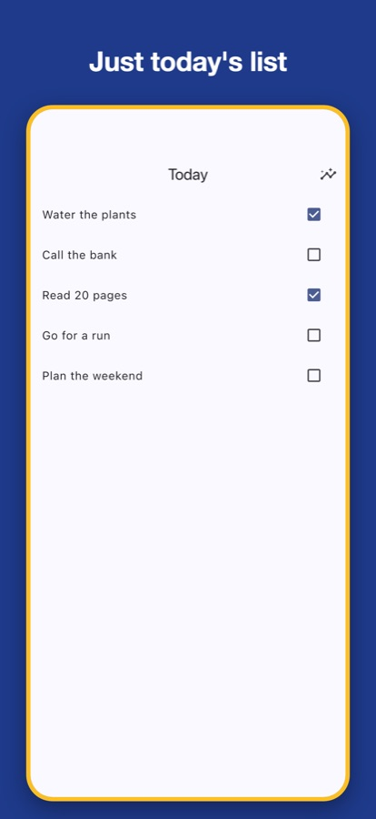
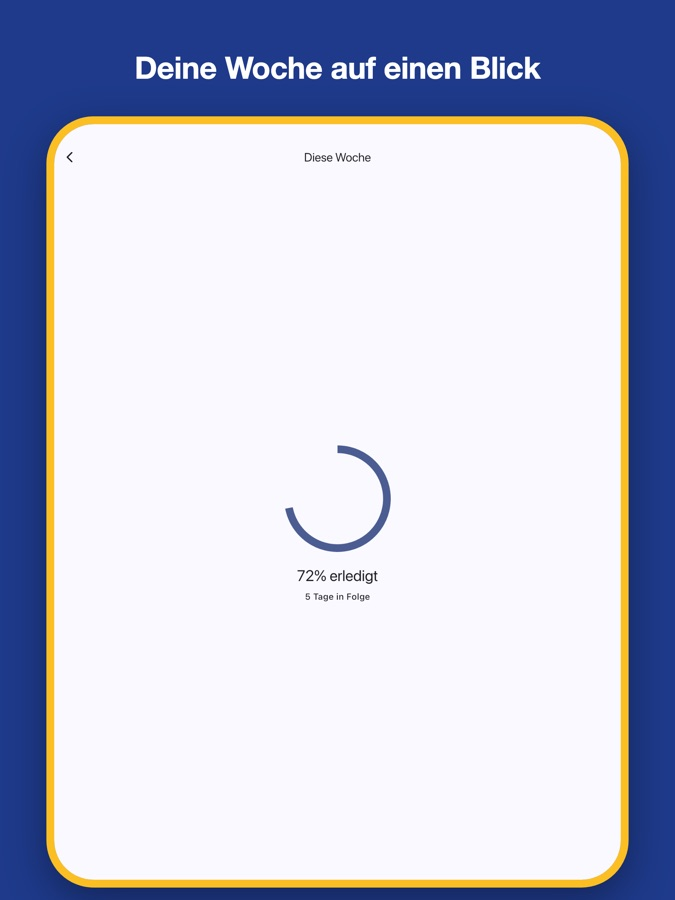
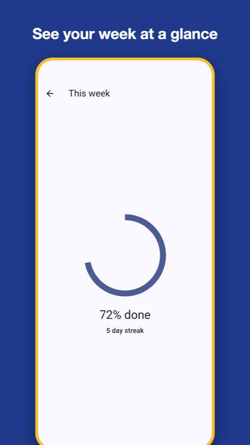
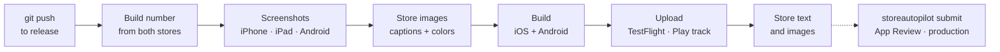
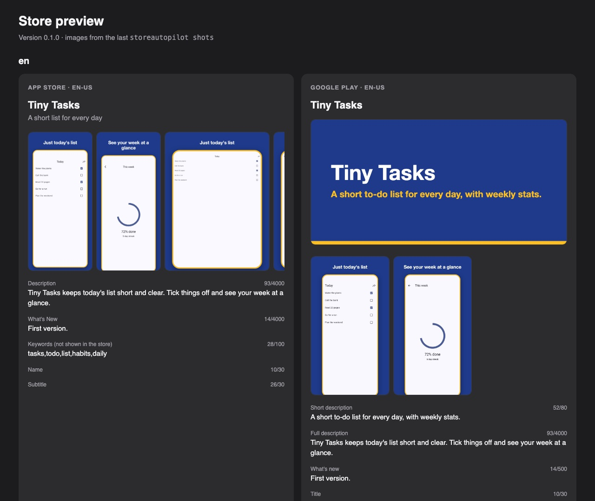
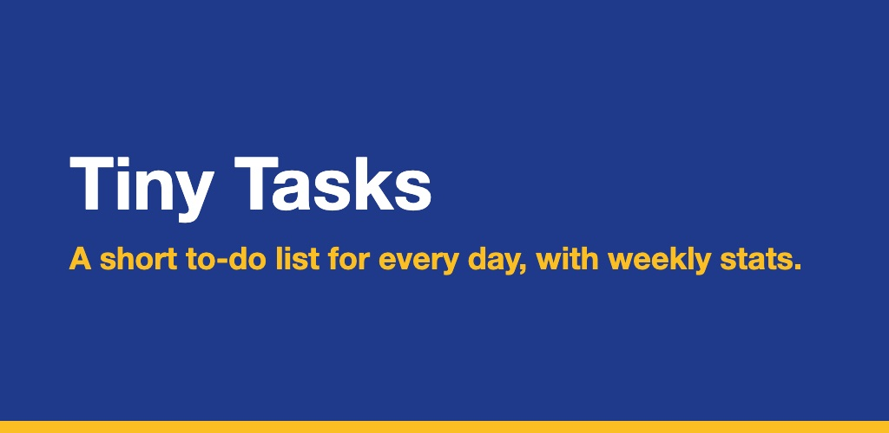

# StoreAutopilot

Release a Flutter app to the App Store and Google Play by pushing to a branch.

<p align="center">
  &nbsp;
  &nbsp;
  
</p>
<p align="center"><sub>Store images made by StoreAutopilot from the <a href="example">example app</a>: iPhone, iPad (in German) and Android.</sub></p>

You push to `release`. Your own Mac takes fresh screenshots of the app, turns them into store images with your
captions and colors, builds the app, uploads it to TestFlight and Google Play, and updates the store text. When the
build has been tested, one more command sends it to App Review and to Google Play production.

It costs nothing to run, your repository stays private, and your signing keys never leave your Mac.

## Why

Shipping an update usually means an hour of store chores: new screenshots for every language and device, the same
text typed into two web consoles, build numbers, two builds, two uploads. StoreAutopilot does that work from two
files kept in your app's repository:

| File | What's in it |
|---|---|
| `storeautopilot.yml` | Platforms, languages, which screenshots to take, brand colors, optional features |
| `store.md` | Everything the stores show: name, description, keywords, release notes, screenshot captions |

Change the files, push, and the stores follow.

## How it works

StoreAutopilot runs on your Mac as a GitHub Actions runner for your private repository. Runners on your own machine
are free, so there are no build minutes to pay for.



1. **Build number.** The highest build number in TestFlight and Google Play, plus one, used for both. The version
   name (`1.2.0`) comes from `pubspec.yaml`; its `+N` is not used, so the number in the stores can differ from it (the
   release says so when it does).
2. **Screenshots.** Your screenshot test (an ordinary Flutter integration test) runs on a 6.9" iPhone simulator, a 13"
   iPad simulator if the app runs on iPad, and an Android emulator, once per language.
3. **Store images.** Each screenshot is placed in an HTML template with its caption and rendered at the exact size
   each store wants. Google Play's feature graphic is made the same way.
4. **Build and upload.** iOS goes to TestFlight; the Android bundle is checked to be signed with your upload key and
   goes to the Play track you chose.
5. **Store text and images.** Uploaded only if they changed since the last release.

Sending a version to App Review and promoting it to Google Play production is a separate command, so a careless push
never reaches reviewers or users.

## Requirements

| You need | For |
|---|---|
| A Mac with Xcode and an iOS simulator runtime | building iOS and taking iPhone/iPad screenshots |
| Flutter | building the app |
| Android Studio with the SDK and one emulator | building Android and taking Android screenshots |
| Google Chrome | rendering the store images |
| Homebrew | installing StoreAutopilot, Ruby and fastlane |
| GitHub CLI, logged in (`gh auth login`) | connecting your Mac as the repository's runner |
| A **private** GitHub repository for your app | running releases on your Mac safely |
| Apple Developer and Google Play developer accounts | publishing |

## Install

    brew install yenerahmetfahri/storeautopilot/storeautopilot
    storeautopilot --version

Homebrew brings Ruby and fastlane along. Update later with `brew upgrade storeautopilot`.

<details>
<summary>Without Homebrew</summary>

Install Ruby 3.1 or newer and fastlane, then:

    git clone https://github.com/yenerahmetfahri/StoreAutopilot.git ~/StoreAutopilot
    ln -s ~/StoreAutopilot/bin/storeautopilot /usr/local/bin/storeautopilot

</details>

## Try it with the example

The [example](example) folder holds a small Flutter app that is already set up. To see what StoreAutopilot makes,
without any store account and without uploading anything:

    git clone https://github.com/yenerahmetfahri/StoreAutopilot.git
    cd StoreAutopilot/example
    storeautopilot shots

It takes the screenshots on the simulators, builds the store images and opens a preview of both store pages:

<p align="center"></p>

## Set up your app

You do this once per app. At any point, `storeautopilot doctor` checks the setup and tells you what is still missing.

### 1. Add the files

In the root of your app's repository:

    storeautopilot init

It asks a few questions (the app's name, languages, support and privacy URLs, App Store category, a brand color) and
writes these files, never overwriting one that exists. Without a terminal (a script, CI) it cannot ask; give the
answers as options instead (`--name`, `--languages en,de`, `--support-url`, `--privacy-url`, `--category`, `--color`),
and it lists what is still a placeholder when it finishes.

| File | What it is |
|---|---|
| `storeautopilot.yml` | Settings; bundle ID and package name are read from your project |
| `store.md` | Store text for every language |
| `storeautopilot/frame.html`, `feature.html` | Templates for the store images; change them as you like |
| `integration_test/store_screenshots_test.dart` | The screenshot test you fill in |
| `test_driver/store_screenshots_driver.dart` | Saves the screenshots; no need to touch it |
| `.github/workflows/store.yml` | The workflow that runs on your Mac |

It also adds the test packages to `pubspec.yaml`, adds rules to `.gitignore` so keys can't be committed, and creates
a private folder for your keys: `~/.storeautopilot/<app_id>/`.

### 2. Settings

```yaml
app_id: my-app                 # name of the key folder, ~/.storeautopilot/my-app
flutter_project: .             # where pubspec.yaml is

locales:                       # your language ids → each store's language code
  en: { apple: en-US, play: en-US }
  de: { apple: de-DE, play: de-DE }

screenshots: [01_home, 02_game, 03_stats]   # in the order the stores show them

brand:
  background: "#111827"
  text: "#FFFFFF"
  accent: "#F59E0B"

ios:
  bundle_id: com.example.myapp

android:
  package: com.example.myapp
  track: internal              # internal, alpha, beta or production
```

Leave out `ios` or `android` if you publish to one store only. A few more settings, all optional:

| Setting | What it does |
|---|---|
| `ios.ipad` | `true`/`false`; by default follows the Xcode project (iPad screenshots when the app runs on iPad) |
| `ios.uses_encryption: false` | Answers Apple's export compliance question once, so TestFlight stops asking for every build |
| `ios.phased_release: true` | After approval, the update reaches users gradually over seven days |
| `ios.testflight_notes: true` | `release_notes` become TestFlight's "What to Test" (the upload waits a few minutes for the build) |
| `android.rollout: 20` | Production starts with 20% of users; widen it with `storeautopilot rollout` |
| `android.release_status: draft` | For apps Google Play still treats as drafts |
| `android.emulator` | Which emulator to use; by default the first one |

### 3. Store text

`store.md` starts with a short header, then has one section per language:

```markdown
---
support_url: https://example.com/support
privacy_url: https://example.com/privacy
copyright: 2026 Example Ltd
review_notes: |
  No login needed. Delete the account in Settings → Delete account.
review_contact: { first_name: Jane, last_name: Doe, phone: "+1 555 010 0100", email: jane@example.com }
third_party_content: false
---
# en
## name
My App
## subtitle
Short line under the name (App Store)
## keywords
puzzle,words,daily
## description
The full description.
## short_description
One sentence for Google Play.
## release_notes
What's new in this version.
## captions
- 01_home: Your words, every day
- 02_game: Play against the clock
- 03_stats: Watch yourself improve
```

One text for both stores is the default. To word a field differently for one store, add a section with the store as a
prefix; it replaces the shared one there and only there:

```markdown
## description
Shared by both stores.
## android_description
Google Play only. (`ios_description` works the same way; so do `name`, `release_notes` and the other text fields.)
```

Every field is checked against the store's limit before anything is built, so a description that is too long fails
in a second, not after a twenty-minute build:

| Field | App Store | Google Play |
|---|---|---|
| name | 30 | 30 |
| subtitle | 30 | — |
| keywords | 100 | — |
| promotional_text | 170 | — |
| short_description | — | 80 |
| description | 4000 | 4000 |
| release_notes | 4000 | 500 |

The header can also hold notes and a contact for App Review, a demo account's user name (`review_demo_user`; its
password goes in `~/.storeautopilot/<app_id>/review_demo_password.txt`, never in `store.md`), and whether the app
shows content it doesn't own (`third_party_content`).

**Already in the stores?** `storeautopilot import` reads the current text from App Store Connect and Google Play and
writes it into `store.md` for you (or `store.imported.md`, if you already have one).

### 4. Screenshot test

Open `integration_test/store_screenshots_test.dart`, start your app with demo data, go to each screen and take a
screenshot with each id from `storeautopilot.yml`:

```dart
testWidgets('store screenshots', (tester) async {
  await tester.pumpWidget(MyApp(locale: storeLocale));
  await takeStoreScreenshot(tester, '01_home');

  await tester.tap(find.text('Play'));
  await takeStoreScreenshot(tester, '02_game');
});
```

`storeLocale` is the language being captured and `storeDevice` is `phone` or `tablet`. Check the result with
`storeautopilot shots`; `storeautopilot preview` shows the page again after you edit `store.md`.

### 5. Keys

Put these in `~/.storeautopilot/<app_id>/`. They stay on your Mac; nothing is stored in git or GitHub.

| File | Where it comes from |
|---|---|
| `asc_key.p8` | App Store Connect → Users and Access → Integrations → App Store Connect API: create a key with the App Manager role |
| `asc_key.json` | `{"key_id": "…", "issuer_id": "…"}`, both shown on that page |
| `play.json` | Google Cloud: a service account with a JSON key, invited in Play Console → Users and permissions. App permissions: *Release apps to testing tracks*, *Manage store presence*, *View app information…*, and for reviews *Reply to reviews* (*Release to production…* to promote). If Google answers "caller does not have permission", the error names the one that is missing |

Android release signing stays in your Gradle setup, with your upload keystore on this Mac.

### 6. Privacy forms

Both stores ask what your app collects and why: **App Privacy** in App Store Connect, **Data safety** in Play
Console. Neither form can be filled in through an API key, so you fill them in by hand — from one list:

    storeautopilot privacy

The first time, it suggests a `privacy` section for `store.md` based on the packages your app uses (AdMob, Firebase,
RevenueCat, sign-in packages and others). After you add it, the same command prints what to tick in each store, in
that store's own words.

### 7. The steps with no API

Done once, by hand:

| Where | What |
|---|---|
| App Store Connect | Create the app record; fill in App Privacy; put the privacy policy and support pages online; agreements, tax and banking for in-app purchases |
| Play Console | Create the app; upload the first bundle by hand (turns on Play App Signing); fill in the App content forms. Personal accounts created after November 2023 need a 14-day closed test with 12 testers before production |
| Xcode | Sign in with your Apple account once |

### 8. Check and connect your Mac

    storeautopilot doctor --online
    storeautopilot runner install

`--online` also signs in to both stores and checks the app records, the version and the first Android upload.
`runner install` downloads GitHub's runner, verifies its checksum, registers it for this repository only and starts
it in the background. It refuses to do so for a public repository.

## Releasing

    git push origin HEAD:release

Keep the Mac awake and online. Follow the run under the repository's Actions tab; a macOS notification tells you when
it finished. Then the build is in TestFlight and on your Play track, and the store pages show the new text and images.

| To… | Run |
|---|---|
| see what a release would do | `storeautopilot release --dry-run` |
| release one platform | `storeautopilot release --only android` |
| keep the screenshots already in the stores | `storeautopilot release --skip-shots` |
| keep the text already in the stores (name, description, keywords…) | `storeautopilot release --skip-text` |
| see both stores at a glance | `storeautopilot status` |
| read and answer reviews | `storeautopilot reviews`, `storeautopilot reviews reply ios:123 "Thanks!"` |

## Going live

When the build has been tested, on GitHub open Actions → Store → Run workflow and tick **submit for review**, or run:

    storeautopilot submit

The latest TestFlight build of the current version goes to App Review, and the newest release on your Play track is
promoted to production. After Apple approves, you release the version in App Store Connect.

With `android.rollout` set, production starts with that share of users. Widen it when all is well:

    storeautopilot rollout 50
    storeautopilot rollout 100

## Several apps

StoreAutopilot keeps each app apart by its `app_id`: its own key folder, work folder and upload history. One Mac can
release any number of apps.

| Your setup | What to do |
|---|---|
| Each app in its own repository | Run `storeautopilot init` and `storeautopilot runner install` in each one. |
| Several apps in one repository | Run `storeautopilot init --app apps/game` once per app (without `--app`, `init` asks which). Each app keeps its files in its own folder, gets its own workflow (`.github/workflows/store-game.yml`) and is released by pushing to its own branch: `git push origin HEAD:release-game`. One runner serves the whole repository. |
| The same keys for all apps | Put `asc_key.p8`, `asc_key.json` and `play.json` once in `~/.storeautopilot/shared/`. A key in an app's own folder takes precedence, for an app under another Apple team or Play account. |

Two releases never run on the Mac at the same time: they would fight over the same simulators and emulator. If
another app's release or screenshot run is busy, the next one says so and waits for its turn.

## Optional features

Everything beyond the basics is off until you turn it on in `storeautopilot.yml`:

```yaml
features:
  store_check: true
  submit_check: true
```

| Feature | What it does |
|---|---|
| `store_check` | Before building, checks both stores: stops if this version is already live or waiting for release, or the app record is missing |
| `store_requirements` | Stops when a store rule in force isn't met: Play target SDK 36 (since Aug 31, 2026), Xcode 26, iOS 13 minimum |
| `review_risks` | Stops on problems that crash the app or get it rejected: missing AdMob app id, tracking without its prompt text; warns about missing permission texts, account deletion, privacy manifest |
| `text_advice` | Points out keywords already in the name, spaces after commas, unused keyword room, long captions, example URLs |
| `privacy_check` | `doctor` compares your privacy declaration with the packages you use |
| `submit_check` | Before submitting, checks everything App Review needs: processed build, screenshots, privacy URL, contact, age rating answers |
| `reuse_screenshots` | Skips capturing when the app hasn't changed since the last capture, which saves a few minutes |
| `resume` | Re-running a failed release of the same commit skips builds that already reached the stores |
| `retries` | Tries store checks and listing updates again after a passing API error (never build uploads) |
| `job_summary` | Writes each step with its duration, or what failed and how to fix it, on the GitHub run page |
| `rollout_guard` | Checks the crash rate in Play's vitals before widening a rollout; `storeautopilot rollout watch` halts a staged rollout whose crash rate passes `android.halt_crash_rate` (1.09% by default) |
| `data_safety_upload` | Uploads `storeautopilot/data_safety.csv`, exported once from Play Console, whenever it changes |
| `api_upload` | Experimental: uploads iOS builds through the App Store Connect API instead of Apple's upload tool |

`storeautopilot doctor` lists which features are on.

## Commands

| Command | What it does |
|---|---|
| `init` | Adds the StoreAutopilot files to an app repository |
| `import` | Writes `store.md` from the text already in both stores |
| `doctor` | Checks tools, settings, store text, keys, repository safety and the runner (`--online`: the stores too) |
| `privacy` | Shows what to tick in App Privacy and Data safety |
| `status` | Shows what App Store Connect and Google Play hold for the app |
| `reviews` | Newest reviews from both stores; `reviews reply` answers one |
| `shots` | Takes the screenshots, makes the store images and opens the preview |
| `preview` | Opens the preview with the last images |
| `release` | Builds, uploads and updates the store listings |
| `submit` | Sends the version to App Review and promotes Google Play to production |
| `rollout 50` | Widens a staged Google Play rollout; 100 finishes it (`rollout watch` with `rollout_guard`) |
| `runner install` | Connects this Mac to the repository as its runner |

Options: `--config PATH`, `--app DIR` (init), `--only ios|android`, `--dry-run`, `--skip-shots`, `--skip-text`, `--fresh-shots`,
`--online`, `--version`.

## Store images

The images come from `storeautopilot/frame.html` and `storeautopilot/feature.html` in your repository: plain HTML and
CSS, filled in with these values:

| Template | Values |
|---|---|
| `frame.html` | `{{caption}}`, `{{screenshot}}`, `{{platform}}` (`ios`, `ipad` or `android`) |
| `feature.html` | `{{name}}`, `{{tagline}}` |
| both | `{{background}}`, `{{text}}`, `{{accent}}`, `{{font}}`, `{{width}}`, `{{height}}` |

| Image | Size |
|---|---|
| App Store, 6.9" iPhone | 1320 × 2868 |
| App Store, 13" iPad | 2064 × 2752 |
| Google Play, phone | 1080 × 1920 |
| Google Play, feature graphic | 1024 × 500 |

<p align="center"></p>

## When something goes wrong

Every command keeps a log in `~/Library/Logs/StoreAutopilot/`, with everything it printed and the full output of
Flutter, Xcode and fastlane; the last 30 are kept. A failure shows one line saying what went wrong, a hint on how to
fix it, and where the log is.

A few things keep an unattended run from going badly:

- No command waits for keyboard input, and one that prints nothing for 30 minutes (an app frozen in its screenshot
  test, say) is stopped together with everything it started.
- A release stops early when the disk has less than 5 GB free.
- Releases of different apps take turns on the Mac instead of running at once.
- Problems with the setup, keys or store text are reported before anything is built.

## Security

- **Keys** live in `~/.storeautopilot/<app_id>/`, readable only by you. Only their file paths are handed to fastlane;
  their contents are never printed or logged. The App Review demo password is written to a private work folder for
  the upload and removed right after.
- **Your Mac runs the workflow.** Anyone who can push to the repository can run code on it, so keep the repository
  private and give push access only to people you trust. StoreAutopilot's runner serves one private repository, the
  workflow runs only on pushes, manual starts and (if you enable it) a schedule — never on pull requests — and
  `doctor` fails if a pull request trigger is added.
- **Nothing secret goes into git:** `init` adds ignore rules and `doctor` fails if keys, keystores or service account
  files are committed.
- **Logs** are readable only by you. They hold build output and store text, never keys.
- Android bundles signed with the debug key are refused before upload.

## Limitations

- Flutter apps only, built on macOS; the Mac has to be on when you push.
- No Android tablet screenshots (Google Play doesn't require them).
- App Privacy and Play's Data safety form have no API for filling them in; `storeautopilot privacy` tells you what
  to tick.

## Built with

| Part | Used for |
|---|---|
| [fastlane](https://fastlane.tools) | Talking to the stores: `deliver`, `pilot` and `gym` for Apple, `supply` for Google Play |
| App Store Connect API key | Signing in to Apple without a password or two-factor prompts; also used by Xcode's automatic signing |
| Flutter `integration_test` | The screenshots, on an iPhone and iPad simulator and an Android emulator |
| Headless Google Chrome | Turning the HTML templates into store images |
| GitHub Actions with a self-hosted runner | Running releases on your Mac |
| Ruby | The tool itself, with no gems beyond fastlane |

## Development

    bin/test

The tests need nothing but Ruby; external commands and fastlane are replaced by fakes. They run on every push and
pull request on GitHub's hosted Linux machines with Ruby 3.1 and 3.4.

## License

MIT. See [LICENSE](LICENSE).
